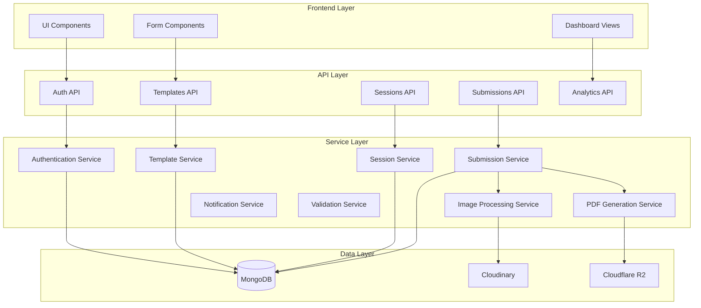

# Design Document: Digital Lab Manual System

## Overview

The Digital Lab Manual System is a comprehensive SaaS platform that digitizes the lab manual workflow for engineering and science colleges. The system replaces traditional paper-based lab records with a secure, time-bound digital submission process that ensures authenticity through real-time faculty verification, proof image requirements, and anti-copy mechanisms.

The platform serves five distinct user roles: Students who submit lab work during active sessions, Lab Faculty who conduct sessions and verify submissions, Faculty Coordinators who create standardized experiment templates, HODs who monitor departmental performance, and Principals who oversee institutional compliance.

The system enforces temporal constraints by allowing submissions only during active lab sessions, requires photographic proof of experiment execution, tracks submission patterns to detect copying, and generates verifiable PDF records with QR codes for authenticity verification.

## Architecture

### High-Level Architecture

The system follows a modern full-stack architecture built on Next.js 16.2.2 with the App Router pattern:

```
┌─────────────────────────────────────────────────────────────┐
│                     Client Layer (Browser)                   │
│  Next.js 16.2.2 + React 19 + TypeScript + Tailwind CSS 4   │
│              shadcn/ui Components + Animations               │
└─────────────────────────────────────────────────────────────┘
                              │
                              ▼
┌─────────────────────────────────────────────────────────────┐
│                   Application Layer                          │
│         Next.js App Router (/app directory)                  │
│    Server Components + Client Components + API Routes        │
└─────────────────────────────────────────────────────────────┘
                              │
                ┌─────────────┼─────────────┐
                ▼             ▼             ▼
    ┌──────────────┐  ┌──────────────┐  ┌──────────────┐
    │   MongoDB    │  │  Cloudinary  │  │ Cloudflare R2│
    │   Database   │  │Image Storage │  │ File Storage │
    └──────────────┘  └──────────────┘  └──────────────┘
```

### Component Architecture



### Technology Stack Rationale


- **Next.js 16.2.2 with App Router**: Server-side rendering, API routes, and file-based routing in a single framework
- **React 19**: Latest React features for optimal performance and developer experience
- **TypeScript**: Type safety across the entire codebase to prevent runtime errors
- **MongoDB**: Flexible document database ideal for hierarchical data structures (templates, submissions, nested observation tables)
- **Cloudinary**: Specialized image CDN with built-in optimization, transformation, and delivery
- **Cloudflare R2**: S3-compatible object storage with zero egress fees for PDF file storage
- **JWT with HTTP-only cookies**: Secure authentication preventing XSS attacks while maintaining stateless sessions
- **shadcn/ui**: Accessible, customizable component library built on Radix UI primitives
- **Tailwind CSS 4**: Utility-first CSS framework for rapid UI development with consistent design

## Components and Interfaces

### Authentication System

**JWT Token Structure:**
```typescript
interface JWTPayload {
  userId: string;
  email: string;
  role: 'student' | 'lab_faculty' | 'faculty_coordinator' | 'hod' | 'principal';
  institutionId: string;
  departmentId?: string;
  iat: number;
  exp: number;
}
```

**Authentication Flow:**
1. User submits credentials to `/api/auth/login`
2. System validates credentials against hashed password in database
3. On success, generates JWT token with 24-hour expiration
4. Stores token in HTTP-only cookie with Secure and SameSite flags
5. Subsequent requests include cookie automatically
6. Middleware validates token on protected routes
7. Token refresh occurs on each authenticated request

**Authorization Middleware:**
```typescript
interface AuthorizationRule {
  roles: string[];
  resource?: string;
  action?: string;
}
```


Role hierarchy: Principal > HOD > Faculty_Coordinator/Lab_Faculty > Student

### Experiment Template System

**Template Parser and Serializer:**

The system implements bidirectional conversion between JSON files and internal template objects:

```typescript
interface ExperimentTemplate {
  id: string;
  version: string; // semantic versioning: major.minor.patch
  title: string;
  description: string;
  objectives: string[];
  steps: ExperimentStep[];
  observationTables: ObservationTable[];
  requiredFields: string[];
  calculationRules: CalculationRule[];
  createdBy: string;
  createdAt: Date;
  updatedAt: Date;
}

interface ExperimentStep {
  order: number;
  instruction: string;
  safetyNotes?: string;
}

interface ObservationTable {
  id: string;
  name: string;
  columns: TableColumn[];
}

interface TableColumn {
  id: string;
  name: string;
  dataType: 'string' | 'number' | 'date' | 'boolean' | 'calculated';
  required: boolean;
  unit?: string;
  minValue?: number;
  maxValue?: number;
  decimalPlaces?: number;
  enumValues?: string[];
  calculationFormula?: string;
}

interface CalculationRule {
  targetColumnId: string;
  formula: string; // e.g., "col1 + col2 * 0.5"
  dependencies: string[]; // column IDs referenced in formula
}
```

**Template Versioning Strategy:**


- Each template modification creates a new version
- Lab sessions reference specific template versions
- Version comparison shows structural diffs
- Prevents deletion of versions with associated submissions
- Semantic versioning: major (breaking changes), minor (new fields), patch (fixes)

### Visual Template Builder (Drag-and-Drop Interface)

**Overview:**

The Visual Template Builder provides a professional, intuitive drag-and-drop interface for Faculty Coordinators to create experiment templates without technical knowledge. Similar to Canva, Google Docs, or Blogger editors, it offers a WYSIWYG experience with predefined sections and customizable components.

**Technology Stack:**

- **Drag-and-Drop Library**: `@dnd-kit/core` + `@dnd-kit/sortable` (Modern, accessible, performant)
- **Rich Text Editor**: `Tiptap` (Headless, extensible, based on ProseMirror)
- **Alternative**: `Lexical` by Meta (Modern, extensible)
- **Layout Engine**: Custom grid system with Tailwind CSS
- **State Management**: Zustand for template builder state

**Template Structure with Standard Lab Sections:**

```typescript
interface VisualTemplate {
  id: string;
  version: string;
  metadata: TemplateMetadata;
  sections: TemplateSection[];
  layout: LayoutConfig;
  theme: ThemeConfig;
}

interface TemplateMetadata {
  title: string;
  courseCode: string;
  department: string;
  semester: string;
  credits: number;
  createdBy: string;
  lastModified: Date;
}

interface TemplateSection {
  id: string;
  type: SectionType;
  order: number;
  title: string;
  isStatic: boolean; // true = not editable by students
  isDynamic: boolean; // true = students can edit
  isRequired: boolean;
  content: SectionContent;
  validation?: ValidationRules;
}

type SectionType = 
  | 'title_aim'           // Static header
  | 'objectives'          // Static list
  | 'theory'              // Static rich text
  | 'apparatus'           // Static/Dynamic list
  | 'procedure'           // Static numbered steps
  | 'observations'        // Dynamic data tables
  | 'calculations'        // Dynamic with formulas
  | 'graphs'              // Dynamic image upload
  | 'results'             // Dynamic text area
  | 'discussion'          // Dynamic text area
  | 'safety_precautions'  // Static list
  | 'custom';             // Custom section

interface SectionContent {
  // For static text sections
  richText?: RichTextContent;
  
  // For list sections
  listItems?: ListItem[];
  
  // For observation tables
  dataTable?: DataTableConfig;
  
  // For calculation sections
  calculationFields?: CalculationField[];
  
  // For image sections
  imageConfig?: ImageUploadConfig;
}

interface RichTextContent {
  json: any; // Tiptap JSON format
  html: string; // Rendered HTML
}

interface ListItem {
  id: string;
  text: string;
  order: number;
  icon?: string;
}

interface DataTableConfig {
  id: string;
  name: string;
  columns: TableColumn[];
  minRows: number;
  maxRows: number;
  allowAddRows: boolean;
}

interface CalculationField {
  id: string;
  label: string;
  formula: string;
  dependencies: string[];
  unit?: string;
  displayFormat?: string;
}

interface ImageUploadConfig {
  maxImages: number;
  minImages: number;
  acceptedFormats: string[];
  maxSizePerImage: number;
  requireCaption: boolean;
}
```

**Standard Lab Template Sections:**

1. **Title/Aim** (Static)
   - Experiment title
   - Aim/objective statement
   - Date field (auto-filled)
   - Student details (auto-filled)

2. **Objectives** (Static)
   - Bulleted list of learning objectives
   - Faculty defines, students view only

3. **Theory** (Static)
   - Rich text content with formatting
   - Support for equations (LaTeX)
   - Images and diagrams
   - References/citations

4. **Apparatus/Software Required** (Static/Hybrid)
   - List of equipment/software
   - Faculty defines standard items (static)
   - Optional: Students can add additional items used (dynamic)

5. **Experimental Procedure** (Static)
   - Numbered step-by-step instructions
   - Safety warnings highlighted
   - Diagrams/images for clarity

6. **Data Tables/Observations** (Dynamic)
   - Customizable data tables
   - Students fill in measurements
   - Real-time validation
   - Support for multiple tables

7. **Calculations/Graphs** (Dynamic)
   - Formula-based calculations
   - Graph/chart upload area
   - Students show their work
   - Auto-calculation where applicable

8. **Results** (Dynamic)
   - Text area for result summary
   - Comparison with theoretical values
   - Error analysis

9. **Discussion** (Dynamic)
   - Text area for analysis
   - Questions to answer (faculty-defined)
   - Conclusion

10. **Safety Precautions** (Static)
    - Important safety guidelines
    - Highlighted warnings
    - Emergency procedures

**Drag-and-Drop Builder Interface:**

```typescript
interface BuilderState {
  template: VisualTemplate;
  selectedSection: string | null;
  draggedSection: string | null;
  previewMode: boolean;
  isDirty: boolean;
}

interface BuilderActions {
  addSection: (type: SectionType, position: number) => void;
  removeSection: (sectionId: string) => void;
  reorderSections: (fromIndex: number, toIndex: number) => void;
  updateSection: (sectionId: string, updates: Partial<TemplateSection>) => void;
  toggleSectionLock: (sectionId: string) => void; // Toggle static/dynamic
  duplicateSection: (sectionId: string) => void;
  saveTemplate: () => Promise<void>;
  publishTemplate: () => Promise<void>;
}
```

**Builder UI Components:**

1. **Sidebar - Section Palette:**
   ```
   ┌─────────────────────┐
   │  Add Sections       │
   ├─────────────────────┤
   │  📋 Title/Aim       │
   │  🎯 Objectives      │
   │  📖 Theory          │
   │  🔬 Apparatus       │
   │  📝 Procedure       │
   │  📊 Observations    │
   │  🧮 Calculations    │
   │  📈 Graphs          │
   │  ✅ Results         │
   │  💬 Discussion      │
   │  ⚠️  Safety         │
   │  ➕ Custom Section  │
   └─────────────────────┘
   ```

2. **Main Canvas - Template Editor:**
   ```
   ┌────────────────────────────────────────┐
   │  [Preview Mode] [Save Draft] [Publish] │
   ├────────────────────────────────────────┤
   │                                        │
   │  ┌──────────────────────────────────┐ │
   │  │ 📋 Title/Aim          [🔒 Static]│ │
   │  │ ═══════════════════════════════  │ │
   │  │ [Drag to reorder]                │ │
   │  │ Experiment Title: ____________   │ │
   │  │ Aim: _________________________   │ │
   │  └──────────────────────────────────┘ │
   │                                        │
   │  ┌──────────────────────────────────┐ │
   │  │ 🎯 Objectives        [🔒 Static] │ │
   │  │ ═══════════════════════════════  │ │
   │  │ • Objective 1                    │ │
   │  │ • Objective 2                    │ │
   │  │ [+ Add Objective]                │ │
   │  └──────────────────────────────────┘ │
   │                                        │
   │  ┌──────────────────────────────────┐ │
   │  │ 📊 Observations     [🔓 Dynamic] │ │
   │  │ ═══════════════════════════════  │ │
   │  │ Table: Voltage Readings          │ │
   │  │ ┌────┬────────┬────────┬──────┐ │ │
   │  │ │ #  │ V1(V)  │ V2(V)  │ I(A) │ │ │
   │  │ ├────┼────────┼────────┼──────┤ │ │
   │  │ │ 1  │ [____] │ [____] │ [__] │ │ │
   │  │ └────┴────────┴────────┴──────┘ │ │
   │  │ [+ Add Row] [+ Add Column]       │ │
   │  └──────────────────────────────────┘ │
   │                                        │
   └────────────────────────────────────────┘
   ```

3. **Properties Panel:**
   ```
   ┌─────────────────────┐
   │  Section Properties │
   ├─────────────────────┤
   │  Title: Observations│
   │                     │
   │  ☑ Required         │
   │  ☐ Static (locked)  │
   │  ☑ Dynamic (editable│
   │                     │
   │  Validation:        │
   │  ☑ Require data     │
   │  ☑ Min 3 rows       │
   │  ☐ Max rows         │
   │                     │
   │  [Delete Section]   │
   │  [Duplicate]        │
   └─────────────────────┘
   ```

**Section Configuration Options:**

```typescript
interface SectionConfig {
  // Visibility
  isVisible: boolean;
  showInStudentView: boolean;
  showInPDF: boolean;
  
  // Editability
  isStatic: boolean;        // Faculty-defined, read-only for students
  isDynamic: boolean;       // Students can edit
  isRequired: boolean;      // Must be completed for submission
  
  // Layout
  width: 'full' | 'half' | 'third';
  alignment: 'left' | 'center' | 'right';
  padding: number;
  backgroundColor?: string;
  
  // Validation
  validation: {
    required: boolean;
    minLength?: number;
    maxLength?: number;
    pattern?: string;
    customValidator?: string;
  };
}
```

**Rich Text Editor Features (for Theory, Discussion sections):**

```typescript
interface RichTextEditorConfig {
  // Formatting
  bold: boolean;
  italic: boolean;
  underline: boolean;
  strikethrough: boolean;
  
  // Structure
  headings: boolean;
  bulletList: boolean;
  orderedList: boolean;
  blockquote: boolean;
  codeBlock: boolean;
  
  // Media
  images: boolean;
  tables: boolean;
  links: boolean;
  
  // Scientific
  equations: boolean;      // LaTeX support via KaTeX
  subscript: boolean;
  superscript: boolean;
  
  // Collaboration
  comments: boolean;
  suggestions: boolean;
}
```

**Data Table Builder:**

```typescript
interface TableBuilderConfig {
  // Column configuration
  columns: {
    id: string;
    name: string;
    dataType: 'text' | 'number' | 'date' | 'select' | 'calculated';
    width: number;
    required: boolean;
    validation?: {
      min?: number;
      max?: number;
      pattern?: string;
      options?: string[]; // for select type
    };
    formula?: string; // for calculated columns
  }[];
  
  // Row configuration
  minRows: number;
  maxRows: number;
  defaultRows: number;
  allowAddRows: boolean;
  allowDeleteRows: boolean;
  
  // Table features
  showRowNumbers: boolean;
  allowSorting: boolean;
  allowFiltering: boolean;
  showTotals: boolean;
  
  // Styling
  headerColor: string;
  alternateRowColors: boolean;
  borderStyle: 'solid' | 'dashed' | 'none';
}
```

**Template Builder Workflow:**

1. **Create New Template:**
   - Faculty clicks "Create Template"
   - Choose from blank or predefined layouts
   - Standard lab template includes all 10 sections by default

2. **Customize Sections:**
   - Drag sections to reorder
   - Click section to edit content
   - Toggle static/dynamic mode
   - Configure validation rules
   - Add/remove sections as needed

3. **Configure Static Content:**
   - Fill in theory using rich text editor
   - Add objectives as bullet points
   - Define procedure steps
   - List apparatus/equipment
   - Add safety precautions

4. **Configure Dynamic Sections:**
   - Design observation tables
   - Define calculation formulas
   - Set validation rules
   - Configure image upload requirements

5. **Preview:**
   - Switch to preview mode
   - See student view
   - Test form validation
   - Check PDF output

6. **Save & Publish:**
   - Save as draft (editable)
   - Publish (creates version, locks for use)
   - Assign to lab groups

**Implementation Libraries:**

```json
{
  "dependencies": {
    "@dnd-kit/core": "^6.1.0",
    "@dnd-kit/sortable": "^8.0.0",
    "@dnd-kit/utilities": "^3.2.2",
    "@tiptap/react": "^2.1.13",
    "@tiptap/starter-kit": "^2.1.13",
    "@tiptap/extension-table": "^2.1.13",
    "@tiptap/extension-mathematics": "^2.1.13",
    "katex": "^0.16.9",
    "zustand": "^4.4.7",
    "react-grid-layout": "^1.4.4",
    "react-beautiful-dnd": "^13.1.1"
  }
}
```

**Component Structure:**

```
/components/template-builder
├── TemplateBuilder.tsx           # Main builder container
├── SectionPalette.tsx            # Draggable section list
├── TemplateCanvas.tsx            # Drop zone and section renderer
├── SectionEditor.tsx             # Edit individual sections
├── PropertiesPanel.tsx           # Section configuration
├── sections/
│   ├── TitleAimSection.tsx
│   ├── ObjectivesSection.tsx
│   ├── TheorySection.tsx
│   ├── ApparatusSection.tsx
│   ├── ProcedureSection.tsx
│   ├── ObservationsSection.tsx
│   ├── CalculationsSection.tsx
│   ├── GraphsSection.tsx
│   ├── ResultsSection.tsx
│   ├── DiscussionSection.tsx
│   └── SafetySection.tsx
├── editors/
│   ├── RichTextEditor.tsx        # Tiptap wrapper
│   ├── TableEditor.tsx           # Data table builder
│   ├── FormulaEditor.tsx         # Calculation formula builder
│   └── ListEditor.tsx            # Bullet/numbered lists
└── preview/
    ├── TemplatePreview.tsx       # Student view preview
    └── PDFPreview.tsx            # PDF output preview
```

**Example: Drag-and-Drop Implementation:**

```typescript
import { DndContext, closestCenter, DragEndEvent } from '@dnd-kit/core';
import { SortableContext, verticalListSortingStrategy, useSortable } from '@dnd-kit/sortable';
import { CSS } from '@dnd-kit/utilities';

function TemplateCanvas({ sections, onReorder }: TemplateCanvasProps) {
  const handleDragEnd = (event: DragEndEvent) => {
    const { active, over } = event;
    if (over && active.id !== over.id) {
      const oldIndex = sections.findIndex(s => s.id === active.id);
      const newIndex = sections.findIndex(s => s.id === over.id);
      onReorder(oldIndex, newIndex);
    }
  };

  return (
    <DndContext collisionDetection={closestCenter} onDragEnd={handleDragEnd}>
      <SortableContext items={sections.map(s => s.id)} strategy={verticalListSortingStrategy}>
        {sections.map(section => (
          <SortableSection key={section.id} section={section} />
        ))}
      </SortableContext>
    </DndContext>
  );
}

function SortableSection({ section }: { section: TemplateSection }) {
  const { attributes, listeners, setNodeRef, transform, transition, isDragging } = useSortable({
    id: section.id
  });

  const style = {
    transform: CSS.Transform.toString(transform),
    transition,
    opacity: isDragging ? 0.5 : 1
  };

  return (
    <div ref={setNodeRef} style={style} {...attributes} {...listeners}>
      <SectionCard section={section} />
    </div>
  );
}
```

**Static vs Dynamic Section Indicators:**

```typescript
function SectionCard({ section }: { section: TemplateSection }) {
  return (
    <div className="border rounded-lg p-4 bg-white shadow-sm hover:shadow-md transition">
      <div className="flex items-center justify-between mb-2">
        <div className="flex items-center gap-2">
          <span className="text-2xl">{getSectionIcon(section.type)}</span>
          <h3 className="font-semibold">{section.title}</h3>
        </div>
        <div className="flex items-center gap-2">
          {section.isStatic && (
            <span className="px-2 py-1 bg-gray-100 text-gray-700 text-xs rounded-full flex items-center gap-1">
              🔒 Static
            </span>
          )}
          {section.isDynamic && (
            <span className="px-2 py-1 bg-blue-100 text-blue-700 text-xs rounded-full flex items-center gap-1">
              🔓 Dynamic
            </span>
          )}
          {section.isRequired && (
            <span className="px-2 py-1 bg-red-100 text-red-700 text-xs rounded-full">
              Required
            </span>
          )}
        </div>
      </div>
      <div className="mt-3">
        {renderSectionContent(section)}
      </div>
    </div>
  );
}
```

**Benefits of Visual Template Builder:**

1. **No Technical Knowledge Required**: Faculty can create templates without understanding JSON or code
2. **WYSIWYG Experience**: See exactly how students will see the template
3. **Standardization**: Predefined sections ensure consistency across experiments
4. **Flexibility**: Custom sections for unique requirements
5. **Validation Built-in**: Configure validation rules visually
6. **Reusability**: Duplicate and modify existing templates
7. **Version Control**: Automatic versioning on publish
8. **Preview Before Publish**: Test student experience before deployment

### Lab Session Management

**Session State Machine:**

```
┌─────────┐  start()   ┌────────┐  stop()   ┌────────┐
│ Created │ ────────> │ Active │ ────────> │ Ended  │
└─────────┘           └────────┘           └────────┘
                           │
                           │ timeout()
                           ▼
                      ┌────────┐
                      │ Ended  │
                      └────────┘
```

**Session Data Model:**
```typescript
interface LabSession {
  id: string;
  labGroupId: string;
  experimentTemplateId: string;
  templateVersion: string;
  conductedBy: string; // Lab_Faculty user ID
  status: 'created' | 'active' | 'ended';
  startTime: Date;
  endTime?: Date;
  duration: number; // minutes
  location?: string;
  equipment: string[]; // equipment IDs
  submissions: SubmissionSummary[];
  createdAt: Date;
}

interface SubmissionSummary {
  studentId: string;
  status: 'not_started' | 'in_progress' | 'submitted' | 'approved' | 'rejected';
  submittedAt?: Date;
}
```

**Session Constraints:**
- Only one active session per Lab_Group + Experiment_Template combination
- Students can only submit during active sessions
- Auto-end sessions after duration expires
- Prevent faculty scheduling conflicts


### Submission System

**Submission Lifecycle:**

```
┌─────────────┐  save_draft()  ┌─────────────┐  submit()  ┌──────────────┐
│ Not Started │ ────────────> │ In Progress │ ─────────> │Pending Review│
└─────────────┘               └─────────────┘            └──────────────┘
                                                                 │
                                                    ┌────────────┼────────────┐
                                                    │                         │
                                              approve()                  reject()
                                                    │                         │
                                                    ▼                         ▼
                                            ┌──────────┐            ┌──────────────┐
                                            │ Approved │            │  Rejected    │
                                            └──────────┘            └──────────────┘
                                                                           │
                                                                    resubmit()
                                                                           │
                                                                           ▼
                                                                  ┌──────────────┐
                                                                  │Pending Review│
                                                                  └──────────────┘
```

**Submission Data Model:**
```typescript
interface Submission {
  id: string;
  labSessionId: string;
  studentId: string;
  experimentTemplateId: string;
  templateVersion: string;
  status: 'not_started' | 'in_progress' | 'submitted' | 'approved' | 'rejected';
  observationData: ObservationData[];
  proofImages: ProofImage[];
  calculations: CalculationResult[];
  results: string;
  conclusion: string;
  submittedAt?: Date;
  reviewedBy?: string;
  reviewedAt?: Date;
  reviewComments?: string;
  rejectionReason?: string;
  editHistory: EditHistoryEntry[];
  flagged: boolean;
  flagReason?: string;
  createdAt: Date;
  updatedAt: Date;
  version: number; // for optimistic locking
}

interface ObservationData {
  tableId: string;
  tableName: string;
  rows: ObservationRow[];
}

interface ObservationRow {
  rowId: string;
  cells: { [columnId: string]: any };
}

interface ProofImage {
  id: string;
  cloudinaryId: string;
  url: string;
  thumbnailUrl: string;
  hash: string; // perceptual hash for duplicate detection
  uploadedAt: Date;
  metadata: ImageMetadata;
}

interface ImageMetadata {
  width: number;
  height: number;
  format: string;
  size: number;
  captureTime?: Date;
  device?: string;
}

interface CalculationResult {
  columnId: string;
  formula: string;
  result: number;
  dependencies: { [columnId: string]: any };
}

interface EditHistoryEntry {
  timestamp: Date;
  field: string;
  oldValue: any;
  newValue: any;
}
```


### Anti-Copy Detection System

**Detection Mechanisms:**

1. **Observation Data Similarity Detection:**
   - Compare observation table data between submissions using Levenshtein distance
   - Flag submissions with >90% similarity
   - Use normalized comparison to handle minor variations

2. **Image Duplicate Detection:**
   - Generate perceptual hash (pHash) for each uploaded image
   - Compare hashes using Hamming distance
   - Reject exact duplicates, flag near-duplicates

3. **Submission Pattern Analysis:**
   - Track time between session start and submission
   - Identify suspiciously fast submissions
   - Detect submissions from same IP within short time window
   - Analyze typing patterns and pause durations

4. **Edit History Tracking:**
   - Record all changes before submission
   - Detect copy-paste behavior (large text blocks added instantly)
   - Track field completion order

**Flagging System:**
```typescript
interface SubmissionFlag {
  submissionId: string;
  flagType: 'duplicate_data' | 'duplicate_image' | 'suspicious_timing' | 'same_ip' | 'copy_paste';
  severity: 'low' | 'medium' | 'high';
  details: string;
  relatedSubmissions: string[];
  flaggedAt: Date;
  reviewedBy?: string;
  resolution?: 'legitimate' | 'misconduct' | 'pending';
}
```


### Image Processing Pipeline

**Upload Flow:**
```
Upload → Validate → Hash → Compress → Transform → Store → Generate URLs
```

**Processing Steps:**

1. **Validation:**
   - Check file format (JPEG, PNG, WebP)
   - Verify minimum dimensions (640x480)
   - Validate file size (max 10MB)
   - Attempt decode to detect corruption

2. **Hashing:**
   - Generate perceptual hash for duplicate detection
   - Store hash in database for comparison

3. **Compression:**
   - Convert PNG to JPEG for optimization
   - Apply quality compression (85% quality)
   - Target file size under 2MB

4. **Transformation:**
   - Generate thumbnail (200x200)
   - Apply progressive JPEG encoding
   - Strip sensitive EXIF data (GPS coordinates)
   - Preserve capture timestamp and device info

5. **Storage:**
   - Upload to Cloudinary with unique identifier
   - Store original and thumbnail versions
   - Generate secure URLs

**Image Service Interface:**
```typescript
interface ImageService {
  uploadImage(file: File, submissionId: string): Promise<ProofImage>;
  deleteImage(imageId: string): Promise<void>;
  getImageUrl(imageId: string, transformation?: ImageTransformation): string;
  generateThumbnail(imageId: string): Promise<string>;
  calculateHash(file: File): Promise<string>;
  compareHashes(hash1: string, hash2: string): number; // similarity score
}

interface ImageTransformation {
  width?: number;
  height?: number;
  quality?: number;
  format?: 'jpg' | 'png' | 'webp';
}
```


### PDF Generation System

**Generation Pipeline:**
```
Approved Submission → Template → Render → Compress → QR Code → Store → Generate URL
```

**PDF Structure:**
```
┌─────────────────────────────────────┐
│ Header: Institution Logo & Title    │
├─────────────────────────────────────┤
│ Student Details & Experiment Info   │
├─────────────────────────────────────┤
│ Objectives & Steps                  │
├─────────────────────────────────────┤
│ Observation Tables (formatted)      │
├─────────────────────────────────────┤
│ Calculations & Results              │
├─────────────────────────────────────┤
│ Proof Images (embedded, compressed) │
├─────────────────────────────────────┤
│ Faculty Approval Details            │
├─────────────────────────────────────┤
│ Footer: QR Code & Verification URL  │
└─────────────────────────────────────┘
```

**PDF Service Interface:**
```typescript
interface PDFService {
  generatePDF(submissionId: string): Promise<PDFDocument>;
  storePDF(pdf: PDFDocument, submissionId: string): Promise<string>;
  generateDownloadURL(pdfId: string, expiresIn: number): Promise<string>;
  embedQRCode(pdf: PDFDocument, verificationUrl: string): PDFDocument;
  compressImages(images: ProofImage[]): Promise<Buffer[]>;
}

interface PDFDocument {
  id: string;
  submissionId: string;
  fileSize: number;
  pageCount: number;
  r2Key: string;
  generatedAt: Date;
}
```

**QR Code Content:**
```
https://labsync.edu/verify/{submissionId}?signature={hmac_signature}
```


### Calculation Engine

**Formula Evaluation:**

The calculation engine evaluates formulas defined in experiment templates:

```typescript
interface CalculationEngine {
  evaluate(formula: string, context: { [columnId: string]: any }): number;
  validateFormula(formula: string, availableColumns: string[]): ValidationResult;
  getDependencies(formula: string): string[];
}

interface ValidationResult {
  valid: boolean;
  errors: string[];
}
```

**Supported Operations:**
- Arithmetic: `+`, `-`, `*`, `/`, `^` (exponentiation)
- Functions: `sqrt()`, `log()`, `ln()`, `sin()`, `cos()`, `tan()`, `abs()`, `round()`
- Conditionals: `IF(condition, trueValue, falseValue)`
- Column references: `@columnId` or `@columnName`

**Example Formulas:**
```
@voltage * @current                    // Power calculation
IF(@temperature > 100, "High", "Low")  // Conditional
sqrt(@x^2 + @y^2)                      // Distance formula
(@reading1 + @reading2 + @reading3) / 3 // Average
```

**Error Handling:**
- Division by zero returns error message
- Invalid column references caught during validation
- Type mismatches handled gracefully
- Circular dependencies detected and prevented


### Analytics and Reporting System

**Analytics Data Models:**

```typescript
interface FacultyPerformanceMetrics {
  facultyId: string;
  period: DateRange;
  sessionsCount: number;
  submissionsReviewed: number;
  averageReviewTime: number; // minutes
  approvalRate: number; // percentage
  rejectionRate: number;
  workloadScore: number;
}

interface StudentProgressMetrics {
  studentId: string;
  labGroupId: string;
  totalExperiments: number;
  completedCount: number;
  pendingCount: number;
  rejectedCount: number;
  completionPercentage: number;
  averageSubmissionTime: number; // minutes after session start
  qualityScore: number;
}

interface DepartmentAnalytics {
  departmentId: string;
  period: DateRange;
  totalSessions: number;
  totalSubmissions: number;
  approvalRate: number;
  activeStudents: number;
  activeFaculty: number;
  storageUsed: number; // bytes
  trends: TrendData[];
}

interface TrendData {
  date: Date;
  metric: string;
  value: number;
}
```

**Report Generation:**
- CSV exports for raw data analysis
- PDF reports with charts and visualizations
- Real-time dashboard updates
- Scheduled email reports


### Notification System

**Notification Data Model:**
```typescript
interface Notification {
  id: string;
  userId: string;
  type: 'submission_approved' | 'submission_rejected' | 'session_started' | 'session_ending' | 'pending_review';
  title: string;
  message: string;
  relatedEntityId: string;
  relatedEntityType: 'submission' | 'session' | 'template';
  read: boolean;
  createdAt: Date;
  expiresAt: Date;
}

interface NotificationPreferences {
  userId: string;
  emailEnabled: boolean;
  inAppEnabled: boolean;
  emailFrequency: 'immediate' | 'daily' | 'weekly';
  quietHoursStart?: string; // HH:mm format
  quietHoursEnd?: string;
  doNotDisturb: boolean;
  enabledTypes: string[];
}
```

**Notification Delivery:**
- In-app notifications stored in database
- Email notifications via SMTP service
- Batch processing for daily/weekly digests
- Respect user preferences and quiet hours
- Critical alerts override preferences

## Data Models

### MongoDB Collections

**users Collection:**
```typescript
{
  _id: ObjectId,
  email: string,
  passwordHash: string,
  role: 'student' | 'lab_faculty' | 'faculty_coordinator' | 'hod' | 'principal',
  firstName: string,
  lastName: string,
  institutionId: ObjectId,
  departmentId?: ObjectId,
  enrollmentNumber?: string, // for students
  employeeId?: string, // for faculty
  active: boolean,
  lastLogin?: Date,
  createdAt: Date,
  updatedAt: Date
}
```


**experimentTemplates Collection:**
```typescript
{
  _id: ObjectId,
  version: string,
  title: string,
  description: string,
  objectives: string[],
  steps: [
    {
      order: number,
      instruction: string,
      safetyNotes?: string
    }
  ],
  observationTables: [
    {
      id: string,
      name: string,
      columns: [
        {
          id: string,
          name: string,
          dataType: 'string' | 'number' | 'date' | 'boolean' | 'calculated',
          required: boolean,
          unit?: string,
          minValue?: number,
          maxValue?: number,
          decimalPlaces?: number,
          enumValues?: string[],
          calculationFormula?: string
        }
      ]
    }
  ],
  requiredFields: string[],
  calculationRules: [
    {
      targetColumnId: string,
      formula: string,
      dependencies: string[]
    }
  ],
  createdBy: ObjectId,
  departmentId: ObjectId,
  previousVersionId?: ObjectId,
  active: boolean,
  createdAt: Date,
  updatedAt: Date
}
```

**labGroups Collection:**
```typescript
{
  _id: ObjectId,
  name: string,
  className: string,
  semester: string,
  academicYear: string,
  departmentId: ObjectId,
  students: ObjectId[],
  experimentTemplates: ObjectId[],
  createdBy: ObjectId,
  active: boolean,
  createdAt: Date,
  updatedAt: Date
}
```


**labSessions Collection:**
```typescript
{
  _id: ObjectId,
  labGroupId: ObjectId,
  experimentTemplateId: ObjectId,
  templateVersion: string,
  conductedBy: ObjectId,
  status: 'created' | 'active' | 'ended',
  startTime: Date,
  endTime?: Date,
  duration: number,
  location?: string,
  equipment: ObjectId[],
  createdAt: Date,
  updatedAt: Date
}
```

**submissions Collection:**
```typescript
{
  _id: ObjectId,
  labSessionId: ObjectId,
  studentId: ObjectId,
  experimentTemplateId: ObjectId,
  templateVersion: string,
  status: 'not_started' | 'in_progress' | 'submitted' | 'approved' | 'rejected',
  observationData: [
    {
      tableId: string,
      tableName: string,
      rows: [
        {
          rowId: string,
          cells: { [columnId: string]: any }
        }
      ]
    }
  ],
  proofImages: [
    {
      id: string,
      cloudinaryId: string,
      url: string,
      thumbnailUrl: string,
      hash: string,
      uploadedAt: Date,
      metadata: {
        width: number,
        height: number,
        format: string,
        size: number,
        captureTime?: Date,
        device?: string
      }
    }
  ],
  calculations: [
    {
      columnId: string,
      formula: string,
      result: number,
      dependencies: { [columnId: string]: any }
    }
  ],
  results: string,
  conclusion: string,
  submittedAt?: Date,
  reviewedBy?: ObjectId,
  reviewedAt?: Date,
  reviewComments?: string,
  rejectionReason?: string,
  editHistory: [
    {
      timestamp: Date,
      field: string,
      oldValue: any,
      newValue: any
    }
  ],
  flagged: boolean,
  flagReason?: string,
  pdfId?: string,
  version: number,
  createdAt: Date,
  updatedAt: Date
}
```


**notifications Collection:**
```typescript
{
  _id: ObjectId,
  userId: ObjectId,
  type: string,
  title: string,
  message: string,
  relatedEntityId: string,
  relatedEntityType: string,
  read: boolean,
  createdAt: Date,
  expiresAt: Date
}
```

**auditLogs Collection:**
```typescript
{
  _id: ObjectId,
  userId: ObjectId,
  action: string,
  resourceType: string,
  resourceId: string,
  details: object,
  ipAddress: string,
  userAgent: string,
  timestamp: Date
}
```

**equipment Collection:**
```typescript
{
  _id: ObjectId,
  name: string,
  identifier: string,
  location: string,
  departmentId: ObjectId,
  maintenanceSchedule: {
    frequency: string,
    lastMaintenance: Date,
    nextMaintenance: Date
  },
  status: 'available' | 'in_use' | 'maintenance' | 'retired',
  issues: [
    {
      reportedBy: ObjectId,
      description: string,
      reportedAt: Date,
      resolved: boolean
    }
  ],
  createdAt: Date,
  updatedAt: Date
}
```

### Database Indexes

**Performance Optimization Indexes:**

```javascript
// users collection
db.users.createIndex({ email: 1 }, { unique: true })
db.users.createIndex({ institutionId: 1, role: 1 })
db.users.createIndex({ departmentId: 1 })

// submissions collection
db.submissions.createIndex({ labSessionId: 1, studentId: 1 }, { unique: true })
db.submissions.createIndex({ studentId: 1, status: 1 })
db.submissions.createIndex({ status: 1, submittedAt: -1 })
db.submissions.createIndex({ reviewedBy: 1, reviewedAt: -1 })
db.submissions.createIndex({ flagged: 1 })

// labSessions collection
db.labSessions.createIndex({ labGroupId: 1, status: 1 })
db.labSessions.createIndex({ conductedBy: 1, startTime: -1 })
db.labSessions.createIndex({ status: 1, startTime: 1 })

// notifications collection
db.notifications.createIndex({ userId: 1, read: 1, createdAt: -1 })
db.notifications.createIndex({ expiresAt: 1 }, { expireAfterSeconds: 0 })

// auditLogs collection
db.auditLogs.createIndex({ userId: 1, timestamp: -1 })
db.auditLogs.createIndex({ resourceType: 1, resourceId: 1, timestamp: -1 })
db.auditLogs.createIndex({ timestamp: -1 })
```


### API Endpoints

**Authentication Endpoints:**
```
POST   /api/auth/login
POST   /api/auth/logout
POST   /api/auth/refresh
GET    /api/auth/me
POST   /api/auth/change-password
```

**Template Endpoints:**
```
GET    /api/templates
GET    /api/templates/:id
POST   /api/templates
PUT    /api/templates/:id
DELETE /api/templates/:id
GET    /api/templates/:id/versions
POST   /api/templates/:id/revert/:version
POST   /api/templates/import
GET    /api/templates/:id/export
POST   /api/templates/batch-import
```

**Lab Group Endpoints:**
```
GET    /api/lab-groups
GET    /api/lab-groups/:id
POST   /api/lab-groups
PUT    /api/lab-groups/:id
DELETE /api/lab-groups/:id
POST   /api/lab-groups/:id/students
DELETE /api/lab-groups/:id/students/:studentId
```

**Lab Session Endpoints:**
```
GET    /api/sessions
GET    /api/sessions/:id
POST   /api/sessions
POST   /api/sessions/:id/start
POST   /api/sessions/:id/stop
GET    /api/sessions/active
GET    /api/sessions/:id/submissions
```

**Submission Endpoints:**
```
GET    /api/submissions
GET    /api/submissions/:id
POST   /api/submissions
PUT    /api/submissions/:id
POST   /api/submissions/:id/submit
POST   /api/submissions/:id/approve
POST   /api/submissions/:id/reject
POST   /api/submissions/:id/images
DELETE /api/submissions/:id/images/:imageId
GET    /api/submissions/:id/pdf
POST   /api/submissions/:id/generate-pdf
POST   /api/submissions/bulk-approve
GET    /api/submissions/flagged
```

**Analytics Endpoints:**
```
GET    /api/analytics/faculty-performance
GET    /api/analytics/student-progress
GET    /api/analytics/department-overview
GET    /api/analytics/submission-trends
POST   /api/analytics/export
```

**Notification Endpoints:**
```
GET    /api/notifications
PUT    /api/notifications/:id/read
PUT    /api/notifications/mark-all-read
GET    /api/notifications/preferences
PUT    /api/notifications/preferences
```

**Verification Endpoint:**
```
GET    /api/verify/:submissionId
```


### API Request/Response Contracts

**Standard Response Format:**
```typescript
interface APIResponse<T> {
  success: boolean;
  data?: T;
  error?: {
    code: string;
    message: string;
    fields?: { [field: string]: string };
  };
  meta?: {
    page?: number;
    limit?: number;
    total?: number;
  };
}
```

**Example: Create Submission**

Request:
```typescript
POST /api/submissions
Content-Type: application/json

{
  labSessionId: "507f1f77bcf86cd799439011",
  observationData: [
    {
      tableId: "table1",
      tableName: "Voltage Readings",
      rows: [
        {
          rowId: "row1",
          cells: {
            "col1": 5.2,
            "col2": 10.4,
            "col3": 15.6
          }
        }
      ]
    }
  ],
  results: "The experiment showed linear relationship",
  conclusion: "Ohm's law verified"
}
```

Response:
```typescript
{
  success: true,
  data: {
    id: "507f1f77bcf86cd799439012",
    labSessionId: "507f1f77bcf86cd799439011",
    studentId: "507f1f77bcf86cd799439013",
    status: "in_progress",
    observationData: [...],
    createdAt: "2024-01-15T10:30:00Z"
  }
}
```

**Example: Validation Error**

Response:
```typescript
{
  success: false,
  error: {
    code: "VALIDATION_ERROR",
    message: "Invalid submission data",
    fields: {
      "observationData[0].rows[0].cells.col1": "Value must be between 0 and 10",
      "proofImages": "At least one proof image is required"
    }
  }
}
```


### Frontend Component Structure

**Page Routes (App Router):**
```
/app
├── (auth)
│   ├── login/page.tsx
│   └── layout.tsx
├── (dashboard)
│   ├── layout.tsx
│   ├── student
│   │   ├── page.tsx (dashboard)
│   │   ├── submissions/page.tsx
│   │   ├── submissions/[id]/page.tsx
│   │   └── sessions/page.tsx
│   ├── faculty
│   │   ├── page.tsx (dashboard)
│   │   ├── sessions/page.tsx
│   │   ├── sessions/[id]/page.tsx
│   │   ├── review/page.tsx
│   │   └── groups/page.tsx
│   ├── coordinator
│   │   ├── page.tsx (dashboard)
│   │   ├── templates/page.tsx
│   │   ├── templates/[id]/page.tsx
│   │   └── templates/new/page.tsx
│   ├── hod
│   │   ├── page.tsx (dashboard)
│   │   ├── analytics/page.tsx
│   │   └── faculty/page.tsx
│   └── principal
│       ├── page.tsx (dashboard)
│       ├── analytics/page.tsx
│       └── departments/page.tsx
├── verify/[id]/page.tsx
└── api
    ├── auth/[...]/route.ts
    ├── templates/[...]/route.ts
    ├── sessions/[...]/route.ts
    ├── submissions/[...]/route.ts
    └── analytics/[...]/route.ts
```

**Shared Components:**
```
/components
├── ui (shadcn/ui components)
│   ├── button.tsx
│   ├── input.tsx
│   ├── table.tsx
│   ├── dialog.tsx
│   └── ...
├── forms
│   ├── observation-table-form.tsx
│   ├── template-form.tsx
│   ├── session-form.tsx
│   └── image-upload.tsx
├── layouts
│   ├── dashboard-layout.tsx
│   ├── sidebar.tsx
│   └── header.tsx
├── submission
│   ├── submission-card.tsx
│   ├── submission-detail.tsx
│   ├── review-panel.tsx
│   └── proof-image-gallery.tsx
├── analytics
│   ├── chart-wrapper.tsx
│   ├── metrics-card.tsx
│   └── trend-chart.tsx
└── common
    ├── loading-spinner.tsx
    ├── error-boundary.tsx
    └── notification-bell.tsx
```


### State Management

**Approach:** React Server Components + Client State

- **Server Components:** Default for data fetching and rendering
- **Client Components:** Interactive UI elements, forms, real-time updates
- **State Libraries:** React hooks (useState, useReducer) for local state
- **Data Fetching:** Server Actions for mutations, fetch in Server Components for reads
- **Caching:** Next.js built-in caching with revalidation strategies

**Client State Patterns:**

```typescript
// Form state management
const [formData, setFormData] = useState<SubmissionFormData>({
  observationData: [],
  proofImages: [],
  results: '',
  conclusion: ''
});

// Optimistic updates
const [optimisticSubmissions, setOptimisticSubmissions] = useOptimistic(
  submissions,
  (state, newSubmission) => [...state, newSubmission]
);

// Real-time session status
const { data: session, mutate } = useSWR(
  `/api/sessions/${sessionId}`,
  fetcher,
  { refreshInterval: 5000 }
);
```

**Server Actions for Mutations:**

```typescript
// app/actions/submissions.ts
'use server'

export async function submitLabWork(formData: FormData) {
  const session = await getServerSession();
  // Validate, process, save
  revalidatePath('/student/submissions');
  return { success: true, submissionId: '...' };
}

export async function approveSubmission(submissionId: string, comments: string) {
  // Validate permissions, update submission
  revalidatePath('/faculty/review');
  return { success: true };
}
```


## Correctness Properties

*A property is a characteristic or behavior that should hold true across all valid executions of a system—essentially, a formal statement about what the system should do. Properties serve as the bridge between human-readable specifications and machine-verifiable correctness guarantees.*

### Property Reflection

After analyzing all acceptance criteria, I identified the following redundancies and consolidations:

**Redundancy Analysis:**
- Properties 13.1 and 50.3 both test bcrypt password hashing with cost factor 12 → Consolidate into single property
- Properties 1.4 and 14.2 both test authentication/authorization on protected endpoints → Combine into comprehensive access control property
- Properties 4.7 and 4.10 both test required field validation → Combine into single validation property
- Properties 18.1, 13.6, and 37.1 all test schema validation → Consolidate into general schema validation property
- Properties 6.4 and 6.5 both test duplicate image detection → Combine into single duplicate prevention property
- Properties 23.1, 23.2, 23.3 and 35.2, 35.5 overlap on observation table validation → Consolidate into comprehensive observation validation property

**Consolidated Properties:**
After reflection, 70+ individual criteria consolidate into approximately 35 unique, non-redundant properties that provide comprehensive coverage without duplication.

### Property 1: Authentication Token Generation

*For any* valid user credentials, when authentication succeeds, the system should generate a JWT token with expiration <= 24 hours and store it in an HTTP-only cookie with Secure and SameSite attributes.

**Validates: Requirements 1.1, 1.6**

### Property 2: Invalid Credentials Rejection

*For any* invalid credentials (wrong password, non-existent user, malformed input), the system should reject the authentication attempt and return an error within 2 seconds.

**Validates: Requirements 1.2**

### Property 3: Expired Token Rejection

*For any* expired authentication token, all protected endpoint requests should be rejected and require re-authentication.

**Validates: Requirements 1.3**

### Property 4: Role-Based Access Control

*For any* user with a specific role and any protected endpoint, access should be granted if and only if the user's role has permission for that endpoint.

**Validates: Requirements 1.4, 14.2**


### Property 5: Logout Token Invalidation

*For any* authenticated user, when they log out, their authentication token should be invalidated and subsequent requests with that token should be rejected.

**Validates: Requirements 1.5**

### Property 6: Template Required Fields Validation

*For any* experiment template, the system should accept it if and only if it contains title, description, objectives, and at least one observation table with defined columns.

**Validates: Requirements 2.1, 2.2, 2.5**

### Property 7: Template Persistence with Unique IDs

*For any* valid experiment template that is saved, the system should persist it to the database and assign a unique identifier that differs from all existing template identifiers.

**Validates: Requirements 2.6**

### Property 8: Session State Transitions

*For any* lab session, starting it should record a start timestamp and set status to "active", and stopping it should record an end timestamp and set status to "ended".

**Validates: Requirements 3.5, 3.6**

### Property 9: Submission Access Control by Session State

*For any* lab session that is not in "active" status, students should be prevented from creating or submitting lab work for that session.

**Validates: Requirements 3.7**

### Property 10: Unique Active Session Constraint

*For any* lab group and experiment template combination, attempting to create a second active session should be rejected while an active session already exists.

**Validates: Requirements 3.8**

### Property 11: Observation Data Type Validation

*For any* observation table data entry, each cell value should match the data type defined in the corresponding column schema, and mismatched types should be rejected with validation errors.

**Validates: Requirements 4.3, 23.1, 35.2**

### Property 12: Required Field Validation

*For any* submission attempt, if any required fields (including observation table required columns) are missing or empty, the system should reject the submission and return field-specific validation errors.

**Validates: Requirements 4.7, 4.10, 23.3, 35.5**


### Property 13: Proof Image Requirements

*For any* submission, it should be accepted only if it includes at least one proof image and no more than 10 proof images, with each image being under 10MB and in JPEG, PNG, or WebP format.

**Validates: Requirements 4.4, 4.6, 4.12, 10.1**

### Property 14: Submission Status Transition

*For any* submission that meets all validation requirements, when submitted, the system should record the submission timestamp and change status from "in_progress" to "submitted".

**Validates: Requirements 4.9**

### Property 15: Approval Immutability

*For any* submission with status "approved", all attempts to modify the submission data should be rejected, ensuring the approved record remains immutable.

**Validates: Requirements 5.6**

### Property 16: Review Action Audit Trail

*For any* submission approval or rejection action, the system should record the reviewing faculty's identifier and the action timestamp in the submission record.

**Validates: Requirements 5.7**

### Property 17: Unique Submission Timestamps

*For any* lab session, each student's submission should have a unique timestamp, and no two submissions from different students should have identical timestamps.

**Validates: Requirements 6.1**

### Property 18: Duplicate Image Prevention

*For any* proof image upload within a lab session, if the image's perceptual hash matches an existing image hash in the same session, the upload should be rejected with a duplicate warning.

**Validates: Requirements 6.4, 6.5**

### Property 19: PDF Generation for Approved Submissions

*For any* submission with status "approved", the system should enable PDF generation and successfully create a PDF document under 20MB containing all submission data and compressed proof images.

**Validates: Requirements 7.1, 7.8**

### Property 20: PDF Download Authentication

*For any* PDF download request, the system should require a valid authentication token and grant access only if the requester is the submission owner or authorized faculty.

**Validates: Requirements 7.6**


### Property 21: Image-Submission Association

*For any* proof image uploaded to a submission, the system should store the association between the image identifier and submission identifier, and when the submission is deleted, all associated images should be removed from storage.

**Validates: Requirements 10.6, 10.7**

### Property 22: Password Hashing Security

*For any* user password stored in the database, it should be hashed using bcrypt with a cost factor of at least 12, and the original plaintext password should never be stored.

**Validates: Requirements 13.1, 50.3**

### Property 23: Transaction Atomicity

*For any* database operation involving multiple related writes, if any operation fails, all operations in the transaction should be rolled back, leaving the database in its original state.

**Validates: Requirements 13.3**

### Property 24: Schema Validation Before Persistence

*For any* data being written to the database, the system should validate it against the defined schema and reject invalid data before any persistence occurs.

**Validates: Requirements 13.6, 18.1, 37.1**

### Property 25: API Response Status Codes

*For any* API request, the response should have an appropriate HTTP status code: 200 for success, 400 for validation errors, 401 for unauthorized, 404 for not found, and 500 for server errors.

**Validates: Requirements 14.3**

### Property 26: API Validation Error Format

*For any* API request that fails validation, the response should have status 400 and include structured error details with field-level error messages.

**Validates: Requirements 14.5, 37.2**

### Property 27: XSS Prevention Through Sanitization

*For any* text input containing HTML or script tags, the system should sanitize the input by removing or escaping the tags before processing or storage.

**Validates: Requirements 18.2**

### Property 28: Text Length Constraints

*For any* text field with a defined maximum length, inputs exceeding that length should be rejected with validation errors.

**Validates: Requirements 18.3**


### Property 29: Server-Side Validation Independence

*For any* data submission, server-side validation should be performed regardless of whether client-side validation was executed, ensuring security even if client validation is bypassed.

**Validates: Requirements 18.9**

### Property 30: Session Timeout Configuration

*For any* user session created, the session should have an inactivity timeout of 24 hours, after which the session should expire and require re-authentication.

**Validates: Requirements 20.3**

### Property 31: Single Session Per User

*For any* user account, when a new session is created, all previous sessions for that user should be invalidated, ensuring only one active session exists.

**Validates: Requirements 20.5**

### Property 32: Password Change Session Invalidation

*For any* user who changes their password, all existing sessions for that user should be immediately invalidated, requiring re-authentication with the new password.

**Validates: Requirements 20.9**

### Property 33: Template Versioning on Modification

*For any* experiment template modification, the system should create a new version with incremented version number while preserving the previous version, and both versions should remain accessible.

**Validates: Requirements 21.1**

### Property 34: Session-Template Version Association

*For any* lab session created, it should reference a specific experiment template version, and that association should remain immutable throughout the session lifecycle.

**Validates: Requirements 21.2**

### Property 35: Template Version Deletion Protection

*For any* experiment template version that has associated submissions, attempts to delete that version should be rejected to maintain referential integrity.

**Validates: Requirements 21.8**

### Property 36: Numeric Range Validation

*For any* observation table column with defined minimum and maximum value constraints, cell values outside that range should be rejected with validation errors.

**Validates: Requirements 23.2**


### Property 37: Template Serialization Round-Trip

*For any* valid experiment template object, serializing it to JSON and then parsing the JSON back should produce an equivalent template object with identical structure and values.

**Validates: Requirements 34.6**

### Property 38: Template Import Validation

*For any* JSON template file uploaded, the system should validate its structure against the experiment template schema, accepting valid templates and rejecting invalid ones with descriptive error messages.

**Validates: Requirements 34.2, 34.3**

### Property 39: Validation Idempotence

*For any* observation table data, validating it multiple times should produce identical validation results each time (validation is deterministic and idempotent).

**Validates: Requirements 35.9, 37.8**

### Property 40: Temporal Constraint Validation

*For any* submission, its submission timestamp should fall within the corresponding lab session's start and end time boundaries, and its approval timestamp (if approved) should be after the submission timestamp.

**Validates: Requirements 36.3, 36.7**

### Property 41: Optimistic Locking for Concurrency

*For any* submission being modified concurrently, the system should detect version conflicts using version numbers and reject the second modification attempt, preventing lost updates.

**Validates: Requirements 36.5**

### Property 42: Unique Submission Per Student-Session

*For any* student and lab session combination, only one submission should be allowed, and attempts to create duplicate submissions should be rejected.

**Validates: Requirements 36.8**

### Property 43: Image Dimension Validation

*For any* proof image upload, images with dimensions smaller than 640x480 pixels should be rejected with validation errors.

**Validates: Requirements 38.1**

### Property 44: Image Integrity Validation

*For any* uploaded image file, the system should attempt to decode it to verify integrity, and corrupted images that fail decoding should be rejected.

**Validates: Requirements 38.6**


### Property 45: Submission Similarity Detection

*For any* two submissions within the same lab session, if their observation data similarity exceeds 90%, both submissions should be flagged for faculty review.

**Validates: Requirements 40.2**

### Property 46: Image Perceptual Hash Comparison

*For any* two proof images, the system should compute perceptual hashes and detect near-duplicates by comparing hash similarity, flagging images with high similarity scores.

**Validates: Requirements 40.3**

### Property 47: Calculation Formula Evaluation

*For any* observation table with calculation formulas, when observation data is entered, the system should evaluate the formulas using the entered values and produce calculated results.

**Validates: Requirements 48.1**

### Property 48: Reactive Calculation Updates

*For any* calculation formula that references other columns, when any referenced column value changes, the calculated value should automatically update to reflect the new inputs.

**Validates: Requirements 48.3**

### Property 49: Calculated Value Range Validation

*For any* calculated column with defined range constraints, if the calculation result falls outside the valid range, the system should reject the submission with a validation error.

**Validates: Requirements 48.6**

## Error Handling

### Error Categories

**Validation Errors (400):**
- Schema validation failures
- Required field violations
- Type mismatches
- Range constraint violations
- File size/format violations
- Duplicate detection

**Authentication Errors (401):**
- Missing or invalid tokens
- Expired sessions
- Invalid credentials

**Authorization Errors (403):**
- Insufficient permissions
- Role-based access denials
- Resource ownership violations


**Not Found Errors (404):**
- Non-existent resources
- Deleted entities
- Invalid identifiers

**Conflict Errors (409):**
- Duplicate submissions
- Concurrent modification conflicts
- Active session conflicts
- Unique constraint violations

**Server Errors (500):**
- Database connection failures
- External service failures (Cloudinary, R2)
- Unexpected exceptions
- System configuration errors

### Error Response Format

All errors follow a consistent structure:

```typescript
{
  success: false,
  error: {
    code: string,           // Machine-readable error code
    message: string,        // Human-readable error message
    fields?: {              // Field-level validation errors
      [fieldName: string]: string
    },
    details?: any,          // Additional error context
    timestamp: string,      // ISO 8601 timestamp
    requestId: string       // Unique request identifier for tracking
  }
}
```

### Error Logging Strategy

**Log Levels:**
- **INFO**: Successful operations, authentication events
- **WARNING**: Validation failures, rate limit hits, retry attempts
- **ERROR**: Failed operations, external service errors, database errors
- **CRITICAL**: System failures, security breaches, data corruption

**Logged Information:**
- Timestamp (ISO 8601)
- User identifier (if authenticated)
- Request ID (for tracing)
- Error message and stack trace
- Request details (method, path, body)
- IP address and user agent
- Response status and duration

**Log Retention:**
- Active logs: 90 days in searchable storage
- Archived logs: 7 years in cold storage for compliance
- Critical security logs: Permanent retention


### Error Recovery Mechanisms

**Retry Logic:**
- Image uploads: 3 retries with exponential backoff
- Email notifications: 3 retries with exponential backoff
- External API calls: 3 retries with circuit breaker pattern
- Database operations: Single retry for transient failures

**Graceful Degradation:**
- If Cloudinary unavailable: Queue uploads for later processing
- If R2 unavailable: Store PDFs temporarily in database
- If email service down: Store notifications for batch sending
- If analytics service slow: Return cached data with staleness indicator

**User-Facing Error Messages:**
- Never expose internal system details
- Provide actionable guidance when possible
- Include support contact for critical errors
- Log detailed errors server-side for debugging

## Testing Strategy

### Dual Testing Approach

The system requires both unit testing and property-based testing for comprehensive coverage:

**Unit Tests:**
- Specific examples demonstrating correct behavior
- Edge cases (empty inputs, boundary values, null handling)
- Integration points between components
- Error conditions and exception handling
- Mock external services (Cloudinary, R2, email)

**Property-Based Tests:**
- Universal properties that hold for all inputs
- Comprehensive input coverage through randomization
- Validation logic across all data types
- State transitions and invariants
- Round-trip properties for serialization

**Balance:**
- Unit tests focus on concrete scenarios and integration
- Property tests verify general correctness across input space
- Together they provide both specific and comprehensive coverage
- Avoid writing too many unit tests for cases covered by properties


### Property-Based Testing Configuration

**Testing Library:** fast-check (JavaScript/TypeScript property-based testing library)

**Configuration:**
- Minimum 100 iterations per property test
- Seed-based reproducibility for failed tests
- Shrinking enabled to find minimal failing examples
- Timeout: 30 seconds per property test

**Test Tagging:**
Each property test must reference its design document property:

```typescript
// Example property test
import fc from 'fast-check';

describe('Authentication Properties', () => {
  it('Property 1: Authentication Token Generation', () => {
    // Feature: digital-lab-manual-system, Property 1: For any valid user credentials, 
    // when authentication succeeds, the system should generate a JWT token with 
    // expiration <= 24 hours and store it in an HTTP-only cookie
    
    fc.assert(
      fc.property(
        fc.record({
          email: fc.emailAddress(),
          password: fc.string({ minLength: 8, maxLength: 128 })
        }),
        async (credentials) => {
          // Create user with credentials
          await createUser(credentials);
          
          // Attempt login
          const response = await login(credentials);
          
          // Verify token generated
          expect(response.token).toBeDefined();
          
          // Verify expiration <= 24 hours
          const decoded = jwt.decode(response.token);
          const expirationHours = (decoded.exp - decoded.iat) / 3600;
          expect(expirationHours).toBeLessThanOrEqual(24);
          
          // Verify HTTP-only cookie
          expect(response.cookies['auth_token']).toBeDefined();
          expect(response.cookies['auth_token'].httpOnly).toBe(true);
          expect(response.cookies['auth_token'].secure).toBe(true);
        }
      ),
      { numRuns: 100 }
    );
  });
});
```

### Test Organization

**Directory Structure:**
```
/tests
├── unit
│   ├── auth
│   │   ├── login.test.ts
│   │   ├── logout.test.ts
│   │   └── token-validation.test.ts
│   ├── templates
│   │   ├── create-template.test.ts
│   │   ├── version-template.test.ts
│   │   └── parser.test.ts
│   ├── sessions
│   │   ├── create-session.test.ts
│   │   ├── start-stop-session.test.ts
│   │   └── session-constraints.test.ts
│   └── submissions
│       ├── create-submission.test.ts
│       ├── validate-submission.test.ts
│       └── approve-reject.test.ts
├── properties
│   ├── auth.properties.test.ts
│   ├── templates.properties.test.ts
│   ├── sessions.properties.test.ts
│   ├── submissions.properties.test.ts
│   ├── validation.properties.test.ts
│   └── calculations.properties.test.ts
├── integration
│   ├── submission-workflow.test.ts
│   ├── approval-workflow.test.ts
│   └── pdf-generation.test.ts
└── e2e
    ├── student-journey.test.ts
    ├── faculty-journey.test.ts
    └── coordinator-journey.test.ts
```


### Test Data Generators

**Custom Generators for Domain Objects:**

```typescript
// Generators for property-based tests
import fc from 'fast-check';

// User generator
const userArbitrary = fc.record({
  email: fc.emailAddress(),
  password: fc.string({ minLength: 8, maxLength: 128 }),
  role: fc.constantFrom('student', 'lab_faculty', 'faculty_coordinator', 'hod', 'principal'),
  firstName: fc.string({ minLength: 1, maxLength: 50 }),
  lastName: fc.string({ minLength: 1, maxLength: 50 })
});

// Experiment template generator
const experimentTemplateArbitrary = fc.record({
  title: fc.string({ minLength: 1, maxLength: 255 }),
  description: fc.string({ minLength: 1, maxLength: 5000 }),
  objectives: fc.array(fc.string({ minLength: 1, maxLength: 500 }), { minLength: 1, maxLength: 10 }),
  observationTables: fc.array(observationTableArbitrary, { minLength: 1, maxLength: 5 })
});

// Observation table generator
const observationTableArbitrary = fc.record({
  name: fc.string({ minLength: 1, maxLength: 100 }),
  columns: fc.array(columnArbitrary, { minLength: 1, maxLength: 20 })
});

// Column generator
const columnArbitrary = fc.record({
  name: fc.string({ minLength: 1, maxLength: 100 }),
  dataType: fc.constantFrom('string', 'number', 'date', 'boolean'),
  required: fc.boolean(),
  unit: fc.option(fc.string({ maxLength: 20 })),
  minValue: fc.option(fc.float()),
  maxValue: fc.option(fc.float())
});

// Submission generator
const submissionArbitrary = fc.record({
  observationData: fc.array(observationDataArbitrary, { minLength: 1 }),
  results: fc.string({ minLength: 1, maxLength: 5000 }),
  conclusion: fc.string({ minLength: 1, maxLength: 5000 })
});
```

### Mock Services

**External Service Mocks:**

```typescript
// Mock Cloudinary service
class MockCloudinaryService {
  private storage = new Map<string, Buffer>();
  
  async upload(file: Buffer): Promise<{ id: string; url: string }> {
    const id = generateId();
    this.storage.set(id, file);
    return { id, url: `https://mock.cloudinary.com/${id}` };
  }
  
  async delete(id: string): Promise<void> {
    this.storage.delete(id);
  }
}

// Mock R2 service
class MockR2Service {
  private storage = new Map<string, Buffer>();
  
  async putObject(key: string, data: Buffer): Promise<void> {
    this.storage.set(key, data);
  }
  
  async getObject(key: string): Promise<Buffer> {
    return this.storage.get(key);
  }
}

// Mock email service
class MockEmailService {
  public sentEmails: Array<{ to: string; subject: string; body: string }> = [];
  
  async send(to: string, subject: string, body: string): Promise<void> {
    this.sentEmails.push({ to, subject, body });
  }
}
```


### Coverage Goals

**Target Coverage Metrics:**
- Line coverage: 80% minimum
- Branch coverage: 75% minimum
- Function coverage: 85% minimum
- Property test coverage: All 49 correctness properties implemented

**Critical Path Coverage:**
- Authentication and authorization: 100%
- Submission validation: 100%
- Data persistence: 95%
- Anti-copy detection: 90%
- PDF generation: 85%

### Continuous Integration

**CI Pipeline:**
1. Lint and type check
2. Run unit tests
3. Run property-based tests
4. Run integration tests
5. Generate coverage report
6. Run E2E tests (on staging)
7. Security scanning
8. Build production bundle

**Test Execution Time Targets:**
- Unit tests: < 2 minutes
- Property tests: < 5 minutes
- Integration tests: < 3 minutes
- E2E tests: < 10 minutes
- Total CI pipeline: < 20 minutes

## Security Considerations

### Authentication Security

**Password Security:**
- Bcrypt hashing with cost factor 12
- Minimum password length: 8 characters
- Password complexity requirements configurable
- Password history to prevent reuse
- Account lockout after 5 failed attempts

**Token Security:**
- JWT tokens with HMAC-SHA256 signing
- HTTP-only cookies prevent XSS access
- Secure flag requires HTTPS
- SameSite=Strict prevents CSRF
- 24-hour expiration with refresh mechanism
- Token revocation on logout and password change

**Session Security:**
- Single active session per user
- Session fingerprinting (IP + User-Agent)
- Automatic session termination on suspicious activity
- CSRF tokens for state-changing operations


### Input Validation and Sanitization

**Validation Layers:**
1. Client-side validation (UX improvement, not security)
2. API route validation (Zod schemas)
3. Service layer validation (business rules)
4. Database schema validation (data integrity)

**Sanitization Rules:**
- HTML/script tag removal from text inputs
- SQL injection pattern detection and rejection
- Path traversal prevention in file operations
- Command injection prevention
- LDAP injection prevention

**File Upload Security:**
- MIME type validation
- File extension whitelist
- Magic number verification
- File size limits enforced
- Virus scanning for uploaded files
- Separate storage domain to prevent XSS

### Authorization Model

**Role Hierarchy:**
```
Principal (highest privileges)
  ├── HOD
  │   ├── Faculty_Coordinator
  │   └── Lab_Faculty
  └── Student (lowest privileges)
```

**Permission Matrix:**

| Resource | Student | Lab_Faculty | Faculty_Coordinator | HOD | Principal |
|----------|---------|-------------|---------------------|-----|-----------|
| View own submissions | ✓ | ✓ | ✓ | ✓ | ✓ |
| Create submission | ✓ | - | - | - | - |
| Review submissions | - | ✓ | - | ✓ | ✓ |
| Create templates | - | - | ✓ | ✓ | ✓ |
| Manage lab groups | - | ✓ | - | ✓ | ✓ |
| Start/stop sessions | - | ✓ | - | ✓ | ✓ |
| View analytics | - | ✓ | ✓ | ✓ | ✓ |
| View dept analytics | - | - | - | ✓ | ✓ |
| View all depts | - | - | - | - | ✓ |
| System config | - | - | - | - | ✓ |

**Resource Ownership:**
- Students can only access their own submissions
- Faculty can access submissions in their sessions
- HOD can access all department resources
- Principal can access all institutional resources


### Data Protection

**Encryption:**
- TLS 1.3 for all data in transit
- AES-256 encryption for sensitive data at rest
- Database field-level encryption for PII
- Encrypted backups with separate key storage

**Data Privacy:**
- GDPR compliance for EU users
- Data minimization principles
- Right to access personal data
- Right to deletion (with academic record exceptions)
- Data retention policies enforced
- Anonymization for analytics

**Audit Trail:**
- Immutable audit logs
- Tamper-evident logging
- All data access logged
- All modifications tracked
- 7-year retention for compliance

### Rate Limiting and DDoS Protection

**Rate Limits:**
- Authentication: 5 attempts per 15 minutes per IP
- API requests: 100 requests per minute per user
- File uploads: 10 uploads per minute per user
- PDF generation: 5 PDFs per hour per user
- Bulk operations: 50 items maximum per request

**DDoS Mitigation:**
- Cloudflare CDN with DDoS protection
- Request throttling at edge
- IP-based blocking for abuse
- CAPTCHA for suspicious traffic
- Automatic scaling for legitimate load spikes

### Security Headers

**HTTP Security Headers:**
```
Content-Security-Policy: default-src 'self'; img-src 'self' https://res.cloudinary.com; script-src 'self' 'unsafe-inline' 'unsafe-eval'
X-Frame-Options: DENY
X-Content-Type-Options: nosniff
Strict-Transport-Security: max-age=31536000; includeSubDomains
Referrer-Policy: strict-origin-when-cross-origin
Permissions-Policy: geolocation=(), microphone=(), camera=(self)
```

### Vulnerability Management

**Security Practices:**
- Dependency scanning with npm audit
- Regular security updates
- Penetration testing quarterly
- Bug bounty program
- Security incident response plan
- Vulnerability disclosure policy


## Performance Optimization

### Caching Strategy

**Cache Layers:**

1. **Browser Cache:**
   - Static assets: 1 year
   - API responses: No cache (dynamic data)
   - Images from Cloudinary: 1 month

2. **CDN Cache (Cloudflare):**
   - Static pages: 1 hour
   - API responses: No cache
   - Images: 1 week

3. **Application Cache (Redis):**
   - User sessions: 24 hours
   - Experiment templates: 1 hour (invalidate on update)
   - Lab group data: 30 minutes
   - Analytics aggregations: 15 minutes

4. **Database Query Cache:**
   - Frequently accessed documents
   - Aggregation pipeline results
   - Automatic invalidation on writes

**Cache Invalidation:**
- Time-based expiration
- Event-based invalidation (on updates)
- Manual cache clearing for admins
- Stale-while-revalidate pattern

### Database Optimization

**Query Optimization:**
- Compound indexes on frequently queried fields
- Covered queries where possible
- Projection to limit returned fields
- Pagination for large result sets
- Aggregation pipeline optimization

**Connection Pooling:**
- Minimum pool size: 10 connections
- Maximum pool size: 100 connections
- Connection timeout: 30 seconds
- Idle timeout: 10 minutes

**Read/Write Splitting:**
- Write operations to primary
- Read operations to replicas
- Eventual consistency acceptable for analytics
- Strong consistency for submissions and approvals


### Image Optimization

**Cloudinary Transformations:**
- Automatic format selection (WebP for supported browsers)
- Responsive images with srcset
- Lazy loading with blur placeholder
- Progressive JPEG encoding
- Quality optimization (85% default)
- Thumbnail generation (200x200)

**Delivery Optimization:**
- CDN distribution globally
- HTTP/2 for multiplexing
- Brotli compression
- Image sprite sheets for icons
- Preloading critical images

### API Performance

**Response Time Targets:**
- Authentication: < 200ms
- Simple queries: < 500ms
- Complex aggregations: < 2s
- File uploads: < 5s (10MB)
- PDF generation: < 10s

**Optimization Techniques:**
- Database query optimization
- Efficient serialization
- Compression (gzip/brotli)
- Parallel processing where possible
- Async operations for heavy tasks

### Frontend Performance

**Loading Performance:**
- First Contentful Paint: < 1.5s
- Largest Contentful Paint: < 2.5s
- Time to Interactive: < 3.5s
- Cumulative Layout Shift: < 0.1

**Optimization Techniques:**
- Code splitting by route
- Dynamic imports for heavy components
- Tree shaking unused code
- Minification and compression
- Critical CSS inlining
- Font optimization (subset, preload)
- Service worker for offline support

**Bundle Size Targets:**
- Initial bundle: < 200KB (gzipped)
- Route chunks: < 50KB each
- Total JavaScript: < 500KB


## Scalability

### Horizontal Scaling

**Application Tier:**
- Stateless Next.js instances
- Load balancer distribution (round-robin)
- Auto-scaling based on CPU/memory
- Minimum 2 instances for high availability
- Maximum 20 instances for peak load

**Database Tier:**
- MongoDB replica set (1 primary, 2 secondaries)
- Automatic failover
- Read scaling with replicas
- Sharding for multi-tenant growth

**Storage Tier:**
- Cloudinary auto-scales
- Cloudflare R2 auto-scales
- No manual intervention needed

### Vertical Scaling

**Resource Allocation:**
- Application servers: 2 CPU, 4GB RAM (baseline)
- Database servers: 4 CPU, 16GB RAM (baseline)
- Scale up during peak hours (lab sessions)
- Scale down during off-hours

### Load Testing

**Test Scenarios:**
- 500 concurrent users
- 1000 submissions per hour
- 100 PDF generations per hour
- 5000 image uploads per hour

**Performance Benchmarks:**
- 95th percentile response time < 2s
- Error rate < 0.1%
- Throughput: 1000 requests/second
- Database queries: 10,000/second

## Monitoring and Observability

### Metrics Collection

**Application Metrics:**
- Request rate and latency
- Error rates by endpoint
- Active user sessions
- API endpoint usage
- Cache hit rates

**Infrastructure Metrics:**
- CPU and memory utilization
- Network throughput
- Disk I/O
- Database connection pool usage
- Queue depths

**Business Metrics:**
- Active lab sessions
- Submissions per hour
- Approval rates
- User engagement
- Storage utilization


### Logging

**Structured Logging:**
```typescript
{
  timestamp: "2024-01-15T10:30:00.000Z",
  level: "INFO" | "WARNING" | "ERROR" | "CRITICAL",
  service: "api" | "worker" | "scheduler",
  requestId: "uuid",
  userId?: "userId",
  action: "login" | "submit" | "approve" | ...,
  resource: "submission" | "session" | "template",
  resourceId?: "resourceId",
  duration?: 123, // milliseconds
  statusCode?: 200,
  error?: {
    message: "error message",
    stack: "stack trace"
  },
  metadata: { ... }
}
```

**Log Aggregation:**
- Centralized logging service
- Real-time log streaming
- Full-text search capability
- Log correlation by requestId
- Alerting on error patterns

### Alerting

**Alert Conditions:**
- Error rate > 5% for 5 minutes
- Response time > 5s for 5 minutes
- Database connection failures
- External service unavailability
- Storage capacity > 80%
- Memory usage > 90%
- Failed backups

**Alert Channels:**
- Email to administrators
- SMS for critical alerts
- Slack/Teams integration
- PagerDuty for on-call rotation

### Health Checks

**Endpoint:** `GET /api/health`

**Response:**
```typescript
{
  status: "healthy" | "degraded" | "unhealthy",
  timestamp: "2024-01-15T10:30:00.000Z",
  services: {
    database: { status: "healthy", latency: 5 },
    cloudinary: { status: "healthy", latency: 150 },
    r2: { status: "healthy", latency: 100 },
    cache: { status: "healthy", latency: 2 }
  },
  metrics: {
    activeUsers: 245,
    activeSessions: 12,
    requestsPerMinute: 450
  }
}
```

**Health Check Frequency:**
- Internal checks: Every 30 seconds
- External monitoring: Every 60 seconds
- Deep health checks: Every 5 minutes


## Deployment Architecture

### Environment Strategy

**Environments:**

1. **Development:**
   - Local development machines
   - Hot reload enabled
   - Mock external services
   - Seeded test data

2. **Staging:**
   - Production-like environment
   - Real external services (test accounts)
   - E2E testing
   - Performance testing

3. **Production:**
   - High availability setup
   - Real user data
   - Monitoring and alerting
   - Automated backups

### Deployment Pipeline

**CI/CD Workflow:**

```
Code Push → GitHub
    ↓
Run Tests (GitHub Actions)
    ↓
Build Docker Image
    ↓
Push to Container Registry
    ↓
Deploy to Staging
    ↓
Run E2E Tests
    ↓
Manual Approval
    ↓
Deploy to Production (Blue-Green)
    ↓
Health Check
    ↓
Switch Traffic
```

**Deployment Strategy:**
- Blue-green deployment for zero downtime
- Automatic rollback on health check failure
- Database migrations run before deployment
- Feature flags for gradual rollout

### Infrastructure as Code

**Technology:** Terraform or AWS CDK

**Resources Managed:**
- Compute instances
- Load balancers
- Database clusters
- Storage buckets
- DNS records
- SSL certificates
- Monitoring dashboards


## Backup and Disaster Recovery

### Backup Strategy

**Database Backups:**
- Automated daily backups at 2:00 AM
- Incremental backups every 6 hours
- Full backups weekly
- Backup verification via test restore
- Geographic redundancy (3 regions)

**Retention Policy:**
- Daily backups: 30 days
- Weekly backups: 90 days
- Monthly backups: 1 year
- Yearly backups: 7 years (compliance)

**File Storage Backups:**
- Cloudinary: Built-in redundancy
- Cloudflare R2: Versioning enabled
- Critical files: Daily backup to separate bucket
- Retention: Same as database

### Disaster Recovery

**Recovery Time Objective (RTO):** 4 hours
**Recovery Point Objective (RPO):** 6 hours

**Recovery Procedures:**

1. **Database Failure:**
   - Automatic failover to replica (< 1 minute)
   - Manual restore from backup if needed (< 2 hours)

2. **Application Failure:**
   - Load balancer redirects to healthy instances
   - Auto-scaling provisions new instances
   - Recovery time: < 5 minutes

3. **Complete Region Failure:**
   - DNS failover to backup region
   - Restore database from backup
   - Provision infrastructure in new region
   - Recovery time: < 4 hours

**Testing:**
- Disaster recovery drills quarterly
- Backup restore testing monthly
- Failover testing monthly
- Documentation updated after each test


## Accessibility

### WCAG 2.1 Level AA Compliance

**Perceivable:**
- Alternative text for all images and icons
- Color contrast ratio ≥ 4.5:1 for normal text
- Color contrast ratio ≥ 3:1 for large text
- No information conveyed by color alone
- Captions for video tutorials
- Text resizable up to 200% without loss of functionality

**Operable:**
- All functionality available via keyboard
- Visible focus indicators (2px outline)
- No keyboard traps
- Skip navigation links
- Sufficient time for timed actions (session warnings)
- No content flashing more than 3 times per second

**Understandable:**
- Page language declared (lang attribute)
- Consistent navigation across pages
- Consistent identification of components
- Clear error messages with suggestions
- Labels for all form inputs
- Help text for complex inputs

**Robust:**
- Valid HTML5 markup
- ARIA landmarks and roles
- ARIA live regions for dynamic content
- Compatible with assistive technologies
- Semantic HTML elements

### Keyboard Navigation

**Navigation Shortcuts:**
- Tab: Move to next interactive element
- Shift+Tab: Move to previous element
- Enter/Space: Activate buttons and links
- Escape: Close modals and dropdowns
- Arrow keys: Navigate within components

**Focus Management:**
- Focus trapped in modals
- Focus returned after modal close
- Focus moved to error messages on validation
- Skip to main content link


### Screen Reader Support

**ARIA Attributes:**
```html
<!-- Form with validation -->
<form aria-labelledby="form-title">
  <h2 id="form-title">Submit Lab Work</h2>
  
  <div role="group" aria-labelledby="observation-label">
    <label id="observation-label">Observation Data</label>
    <input 
      type="text" 
      aria-required="true"
      aria-invalid="false"
      aria-describedby="observation-help observation-error"
    />
    <span id="observation-help">Enter numeric values</span>
    <span id="observation-error" role="alert" aria-live="polite"></span>
  </div>
  
  <button type="submit" aria-label="Submit lab work for review">
    Submit
  </button>
</form>

<!-- Dynamic content updates -->
<div aria-live="polite" aria-atomic="true">
  <p>Submission approved by Dr. Smith</p>
</div>

<!-- Navigation -->
<nav aria-label="Main navigation">
  <ul>
    <li><a href="/dashboard" aria-current="page">Dashboard</a></li>
    <li><a href="/submissions">Submissions</a></li>
  </ul>
</nav>
```

**Announcements:**
- Form submission success/failure
- Validation errors
- Session start/end notifications
- Approval/rejection updates
- Loading states

### Mobile Accessibility

**Touch Targets:**
- Minimum size: 44x44 pixels
- Adequate spacing between targets
- Large tap areas for primary actions

**Gestures:**
- No gesture-only functionality
- Alternative methods for complex gestures
- Swipe actions have button alternatives


## Internationalization

### Supported Languages

**Initial Release:**
- English (en-US) - Default
- Hindi (hi-IN)
- Tamil (ta-IN)
- Telugu (te-IN)
- Kannada (kn-IN)

**Future Expansion:**
- Additional Indian languages
- International languages as needed

### Implementation Approach

**Translation Files:**
```typescript
// locales/en-US.json
{
  "auth": {
    "login": "Login",
    "email": "Email Address",
    "password": "Password",
    "loginButton": "Sign In",
    "invalidCredentials": "Invalid email or password"
  },
  "submission": {
    "title": "Submit Lab Work",
    "observations": "Observation Data",
    "proofImages": "Proof Images",
    "submit": "Submit for Review",
    "validationError": "Please complete all required fields"
  }
}

// locales/hi-IN.json
{
  "auth": {
    "login": "लॉगिन",
    "email": "ईमेल पता",
    "password": "पासवर्ड",
    "loginButton": "साइन इन करें",
    "invalidCredentials": "अमान्य ईमेल या पासवर्ड"
  }
}
```

**Usage in Components:**
```typescript
import { useTranslation } from 'next-intl';

export default function LoginForm() {
  const t = useTranslation('auth');
  
  return (
    <form>
      <h1>{t('login')}</h1>
      <input placeholder={t('email')} />
      <input type="password" placeholder={t('password')} />
      <button>{t('loginButton')}</button>
    </form>
  );
}
```

### Locale-Specific Formatting

**Date and Time:**
- en-US: MM/DD/YYYY, 12-hour format
- hi-IN: DD/MM/YYYY, 24-hour format
- Automatic formatting based on user locale

**Numbers:**
- Decimal separator: . (US) vs , (India)
- Thousands separator: , (US) vs , (India)
- Currency: $ vs ₹

**Text Direction:**
- LTR for all initial languages
- RTL support architecture for future expansion


## Migration Strategy

### Data Migration

**From Paper-Based System:**

1. **User Import:**
   - CSV import for bulk user creation
   - Validation of email uniqueness
   - Automatic password generation
   - Welcome email with credentials

2. **Historical Data:**
   - Optional: Scan and upload past lab records as PDFs
   - Associate with student accounts
   - Read-only historical records
   - No retroactive validation

3. **Template Creation:**
   - Faculty coordinators create templates for current semester
   - Gradual rollout by department
   - Pilot program with select courses

### Phased Rollout

**Phase 1: Pilot (Month 1-2)**
- Single department, 2-3 courses
- 50-100 students
- Intensive support and feedback
- Iterate on issues

**Phase 2: Department Expansion (Month 3-4)**
- Full department rollout
- All courses in pilot department
- 500-1000 students
- Training for all faculty

**Phase 3: Institution-Wide (Month 5-6)**
- All departments
- All courses with lab components
- 5000+ students
- Dedicated support team

**Phase 4: Optimization (Month 7+)**
- Performance tuning based on usage
- Feature enhancements
- Integration with other systems
- Advanced analytics

### Training and Support

**Training Materials:**
- Video tutorials for each user role
- PDF user guides
- Interactive walkthroughs
- FAQ documentation

**Support Channels:**
- In-app help system
- Email support
- Phone support during business hours
- Dedicated support during initial rollout

**Faculty Training:**
- 2-hour workshop for coordinators
- 1-hour workshop for lab faculty
- Hands-on practice sessions
- Office hours for questions

**Student Onboarding:**
- 15-minute orientation video
- First-time user wizard
- Tooltips and contextual help
- Peer support from early adopters


## Future Enhancements

### Planned Features

**Version 2.0 (6-12 months):**
- Mobile native apps (iOS/Android)
- Offline submission capability with sync
- Advanced analytics with ML insights
- Plagiarism detection using ML models
- Integration with Learning Management Systems (LMS)
- Video proof support (in addition to images)
- Collaborative experiments (group submissions)
- Peer review functionality

**Version 3.0 (12-24 months):**
- Virtual lab simulations integration
- Augmented reality for equipment guidance
- Real-time collaboration during lab sessions
- Advanced equipment management with IoT
- Predictive analytics for student performance
- Automated grading for objective assessments
- Integration with institutional ERP systems
- Multi-institution support (SaaS expansion)

### Technical Debt Management

**Continuous Improvement:**
- Quarterly code refactoring sprints
- Dependency updates monthly
- Performance optimization reviews
- Security audit quarterly
- Architecture review bi-annually

**Monitoring Technical Debt:**
- Code complexity metrics
- Test coverage tracking
- Documentation completeness
- Deprecated API usage
- Performance regression tracking

## Conclusion

This design document provides a comprehensive technical blueprint for the Digital Lab Manual System. The architecture leverages modern web technologies (Next.js 16.2.2, React 19, MongoDB) to deliver a secure, scalable, and user-friendly platform that addresses the core requirements of digitizing lab manual workflows.

Key design decisions include:

1. **Security-first approach** with JWT authentication, role-based access control, and comprehensive input validation
2. **Anti-copy mechanisms** using perceptual hashing, similarity detection, and temporal analysis
3. **Scalable architecture** supporting horizontal scaling and high availability
4. **Property-based testing** ensuring correctness across all input spaces
5. **Accessibility compliance** meeting WCAG 2.1 Level AA standards
6. **Performance optimization** with caching, CDN delivery, and efficient database queries

The system is designed to handle 500+ concurrent users, process thousands of submissions daily, and maintain 99.9% uptime while ensuring academic integrity through real-time verification and comprehensive audit trails.

